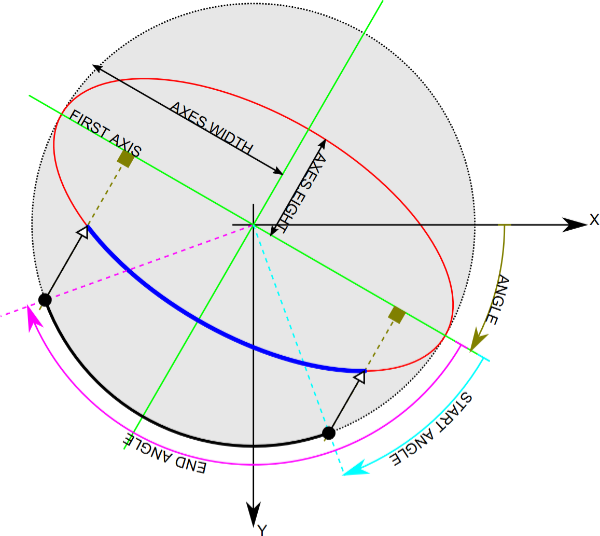

# Hack Kosice Marathon - Thermo Fisher Scientific

## Assignment

The goal is to develop an application that can load an image from a transmission electron microscope in a TIFF image format, analyze whether there is an edge of electron beam visible in the input image and if so, fit the beam edge by an ellipse model. The output of the designed algorithm therefore will be formed by ellipse parameters in the desired format.

Two datasets will be available during the competition. The training dataset with known ground truth ellipses parameters will be available at the start of the competition. The testing dataset, which will be used for evaluation of the quality of ellipse fitting, will be published shortly before the competition’s finish.

## Technical aspects

1.	The input data are single-channel, 16-bit TIFF images divided into seven categories according to the image’s information content (different illumination types, optical aberrations, cut-offs presence, etc.). The image categories should ease orientation in the provided dataset. Note that the whole range of values in 16-bit image (0 - 65 535) might not be utilized and therefore the beam might not be visible in some image viewers.
2.	The output of the algorithm will be a CSV file containing parameters of the fitted ellipses in the correct format (see the enclosed specifications)
3.	The algorithm’s performance in terms of ellipse fitting precision will be evaluated using the evaluation function comparing fitted ellipses with the manually labeled ground truth ellipses. 
4.	The algorithm must be able to fit the ellipse and to decide whether the is an electron beam edge on which an ellipse can be fitted.
5.	The designed algorithm will utilize only input image data, no changes in its behavior based on category membership are allowed.
6.	The use of open-source libraries is not restricted.

## Evaluation criteria

The team with the highest number of points out of a total of 100 points wins. The point evaluation consists of:

* The precision of an ellipse fitting; ability to recognize a beam border in the image on which an ellipse can be fitted. Evaluation is based on the enclosed function by maximally 80 points.
* The computational complexity of the proposed solution which will be evaluated subjectively by the committee considering used programming language and hardware. The maximum is 20 points.  

## Appendix

### Format of the final CSV file

Example of the final CSV file with one found ellipse parameters and the case that no electron beam border is in the image:

```
filename,ellipse_center_x,ellipse_center_y,ellipse_majoraxis,ellipse_minoraxis,ellipse_angle,elapsed_time
2018-02-15 17.26.47.474000_metadata.tiff,626.76,494.98,387.96,381.45,171,123
2018-02-15 17.29.31.987000_metadata.tiff,,,,,,123
```

The first row is a header of the following variable names:
* `filename` – full name of the input image (without path, with file name extension)
* `ellipse_center_x` – x-coordinate of an ellipse center \[pixels\] 
* `ellipse_center_y` – y-coordinate of an ellipse center \[pixels\]
* `ellipse_majoraxis` – size of the main semi-axis \[pixels\]
* `ellipse_minoraxis` – size of the minor semi-axis \[pixels\]
* `ellipse_angle` – ellipse rotation angle \[°\]
* `elapsed_time` – algorithm running time for the current image in milliseconds (starts after loading the image, ends before storing of the ellipse parameters).
* The rows correspond to ellipses parameters of the corresponding images. If there is no beam contour to-be-fitted, ellipse parameters should be empty.
* As the evaluation of the testing database is automatic, the CSV file format needs to be strictly followed. 

### Coordinate system

Ellipse parameters coordinate system follows the coordinate system used in OpenCV (4.5.1) for ellipse drawing.



* The origin of the coordinate system is the upper left corner.
* X-axis values increase from left to right.
* Y-axis values increase from top to bottom.
* Major semiaxis is the longer one.
* Ellipse rotation angle increases clockwise and its origin (0°) corresponds to the x-axis.

### Pseudocode of the evaluation function

```
FUNCTION evaluate_ellipse_fit(image_filename, fit_ellipse):
    gt_ellipse <- get_ground_truth_ellipse_from_csv(image_filename)

    IF gt_ellipse IS NOT empty:
        IF fit_ellipse IS NOT empty:
            gt_ellipse_binary_image <- draw_binary_ellipse(gt_ellipse)
            fit_ellipse_binary_image <- draw_binary_ellipse(fit_ellipse)

            gt_sum <- sum(gt_ellipse_binary_image)
            fit_sum <- sum(fit_ellipse_binary_image)

            overlap_binary_image <- gt_ellipse_binary_image AND fit_ellipse_binary_image
            overlap_sum <- sum(overlap_binary_image)

            fit_score <- overlap_sum / max(gt_sum, fit_sum)
        ELSE:
            fit_score <- 0
    ELSE:
        IF fit_ellipse IS NOT empty:
            fit_score <- 0
        ELSE:
            fit_score <- 1

    RETURN fit_score
```
